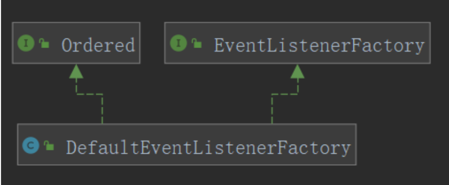

#第一章 Spring核心 IOC实现

##准备工作

### 注册内置PostProcess
这些后置处理器都非常重要！在我们Bean的创建过程中起着至关重要的作用， 属于开Bean元勋.
this.reader = new AnnotatedBeanDefinitionReader(this);

####internalConfigurationAnnotationProcessor、ConfigurationClassPostProcessor
在这个类中，会解析加了@Configuration的配置类，还会解析@ComponentScan、@ComponentScans注解扫描的包，以及解析@Import等注解。

####internalEventListenerFactory、DefaultEventListenerFactory
负责创建监听器：ApplicationListenerMethodAdapter为标注了@EventListener的方法
创建调用监听适配器：ApplicationListenerMethodAdapter

####internalEventListenerProcessor、EventListenerMethodProcessor
实现了SmartInitializingSingleton会调用afterSingletonsInstantiated()

在方法中获取所有bean查找方法中标注了@EventListener， 调用DefaultEventListenerFactory创建事件适配器

最终AbstractApplicationEventMulticaster#addApplicationListener 添加到监听器集合中

####internalAutowiredAnnotationProcessor、AutowiredAnnotationBeanPostProcessor
用于解析@Autowired

####internalCommonAnnotationProcessor、CommonAnnotationBeanPostProcessor
它负责解析@Resource、@WebServiceRef、@EJB三个注解。这三个注解都是定义在javax.*包下的注解，属于java中的注解。

####internalRequiredAnnotationProcessor、RequiredAnnotationBeanPostProcessor
解析@Required，注解为为了保证所对应的属性必须被设置

####AnnotationAwareOrderComparator
解析@Order进行排序
####ContextAnnotationAutowireCandidateResolver

### 注册扫描器
可以根据配置类扫描到所有的Bean。此处scanner实例不作为配置类中的扫描实例，此实例是给单独提供给applicationContext去扫描包的

this.scanner = new ClassPathBeanDefinitionScanner

**扫描器**

- 会加载系统环境变量和资源读取器，并且里面定义了扫描包的核心方法doScan().
- 但是这里的scanner只用于applicationContext调用调度扫描包注册beanDefinition
- 还有个非常重要的地方，new ClassPathBeanDefinitionScanner的时候会调用registerDefaultFilters();在里面注册扫描时过滤候选component的includeFilters

### 注册配置类

将配置类注册到BeanDefinitionMap中

register(annotatedClasses);

##监听器
###创建事件多播器
initApplicationEventMulticaster()

new SimpleApplicationEventMulticaster(beanFactory);

beanFactory.registerSingleton(APPLICATION_EVENT_MULTICASTER_BEAN_NAME,this.applicationEventMulticaster);

###ApplicationListener接口的监听器解析过程
refresh->registerListeners将监听器的名字添加到多播器中：applicationListenerBeans

这里思考一个问题：

为什么registerListeners注册了一遍监听器在BeanPostProcerssor中又添加一次呢？

答案：为了懒加载的漏网之鱼！

在prepareBeanFactory中注册了BeanPostProcessor

###@EventListner注解的解析过程

###publishEvent

##解析BeanDefinition

##注册BeanPostProcessor

##Bean创建过程

#第二章 Spring AOP实现

#第三章 Spring 事务实现

#第四章 Spring5新特性

