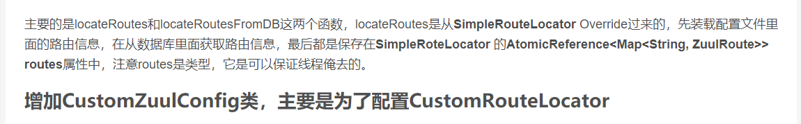

<pre>
zuul:
  routes:
    users:
      path: /myusers/**
      stripPrefix: false

</pre>

<pre>
public static class ZuulRouteVO {

        /**
         * The ID of the route (the same as its map key by default).
         */
        private String id;

        /**
         * The path (pattern) for the route, e.g. /foo/**.
         */
        private String path;

        /**
         * The service ID (if any) to map to this route. You can specify a physical URL or
         * a service, but not both.
         */
        private String serviceId;

        /**
         * A full physical URL to map to the route. An alternative is to use a service ID
         * and service discovery to find the physical address.
         */
        private String url;

        /**
         * Flag to determine whether the prefix for this route (the path, minus pattern
         * patcher) should be stripped before forwarding.
         */
        private boolean stripPrefix = true;

        /**
         * Flag to indicate that this route should be retryable (if supported). Generally
         * retry requires a service ID and ribbon.
         */
        private Boolean retryable;

        private Boolean enabled;

        public String getId() {
            return id;
        }

        public void setId(String id) {
            this.id = id;
        }

        public String getPath() {
            return path;
        }

        public void setPath(String path) {
            this.path = path;
        }

        public String getServiceId() {
            return serviceId;
        }

        public void setServiceId(String serviceId) {
            this.serviceId = serviceId;
        }

        public String getUrl() {
            return url;
        }

        public void setUrl(String url) {
            this.url = url;
        }

        public boolean isStripPrefix() {
            return stripPrefix;
        }

        public void setStripPrefix(boolean stripPrefix) {
            this.stripPrefix = stripPrefix;
        }

        public Boolean getRetryable() {
            return retryable;
        }

        public void setRetryable(Boolean retryable) {
            this.retryable = retryable;
        }

        public Boolean getEnabled() {
            return enabled;
        }

        public void setEnabled(Boolean enabled) {
            this.enabled = enabled;
        }
    }

</pre>

<pre>
public class CustomRouteLocator extends SimpleRouteLocator implements RefreshableRouteLocator {

    public final static Logger logger = LoggerFactory.getLogger(CustomRouteLocator.class);

    private JdbcTemplate jdbcTemplate;

    private ZuulProperties properties;

    public void setJdbcTemplate(JdbcTemplate jdbcTemplate) {
        this.jdbcTemplate = jdbcTemplate;
    }

    public CustomRouteLocator(String servletPath, ZuulProperties properties) {

        super(servletPath, properties);
        this.properties = properties;
        System.out.println(properties.toString());
        logger.info("servletPath:{}", servletPath);
    }

    @Override
    public void refresh() {
        doRefresh();
    }

    @Override
    protected Map<String, ZuulProperties.ZuulRoute> locateRoutes() {
        LinkedHashMap<String, ZuulProperties.ZuulRoute> routesMap = new LinkedHashMap<>();
        System.out.println("start " + new Date().toLocaleString());
        //从application.properties中加载路由信息
        routesMap.putAll(super.locateRoutes());
        //从db中加载路由信息
        routesMap.putAll(locateRoutesFromDB());
        //优化一下配置
        LinkedHashMap<String, ZuulProperties.ZuulRoute> values = new LinkedHashMap<>();
        for (Map.Entry<String, ZuulProperties.ZuulRoute> entry : routesMap.entrySet()) {
            String path = entry.getKey();
            System.out.println(path);
            // Prepend with slash if not already present.
            if (!path.startsWith("/")) {
                path = "/" + path;
            }
            if (StringUtils.hasText(this.properties.getPrefix())) {
                path = this.properties.getPrefix() + path;
                if (!path.startsWith("/")) {
                    path = "/" + path;
                }
            }
            values.put(path, entry.getValue());
        }
        return values;
    }

    private Map<String, ZuulProperties.ZuulRoute> locateRoutesFromDB() {
        Map<String, ZuulProperties.ZuulRoute> routes = new LinkedHashMap<>();
        List<ZuulRouteVO> results = jdbcTemplate.query("select * from gateway_api_define where enabled = true ", new
                BeanPropertyRowMapper<>(ZuulRouteVO.class));
        for (ZuulRouteVO result : results) {
            if (StringUtils.isEmpty(result.getPath()) ) {
                continue;
            }
            if (StringUtils.isEmpty(result.getServiceId()) && StringUtils.isEmpty(result.getUrl())) {
                continue;
            }
            ZuulProperties.ZuulRoute zuulRoute = new ZuulProperties.ZuulRoute();
            try {
                BeanUtils.copyProperties(result, zuulRoute);
            } catch (Exception e) {
                logger.error("=============load zuul route info from db with error==============", e);
            }
            routes.put(zuulRoute.getPath(), zuulRoute);
        }
        return routes;
    }   
}

</pre>

<pre>
@Configuration
public class CustomZuulConfig {
    @Autowired
    ZuulProperties zuulProperties;
    @Autowired
    ServerProperties server;
    @Autowired
    JdbcTemplate jdbcTemplate;

    @Bean
    public CustomRouteLocator routeLocator() {
        CustomRouteLocator routeLocator = new CustomRouteLocator(this.server.getServlet().getPath(), this.zuulProperties);
        routeLocator.setJdbcTemplate(jdbcTemplate);
        return routeLocator;
    }
}
</pre>

CustomerRouteLocator 去数据库获取路由配置信息，需要一个JdbcTemplate Bean。this.zuulProperties 就是配置文件里面的路由配置，应该是网关服务启动时自动就获取过来的。

**RefreshRouteService类，用于实现数据库路由信息的刷新**

<pre>
@Service
public class RefreshRouteService {
    @Autowired
    ApplicationEventPublisher publisher;

    @Autowired
    RouteLocator routeLocator;

    public void refreshRoute() {
        RoutesRefreshedEvent routesRefreshedEvent = new RoutesRefreshedEvent(routeLocator);
        publisher.publishEvent(routesRefreshedEvent);

    }
}

</pre>

**当然也要提供RefreshController，提供从浏览器访问的刷新功能**

<pre>
@RestController
public class RefreshController {
    @Autowired
    RefreshRouteService refreshRouteService;

    @Autowired
    ZuulHandlerMapping zuulHandlerMapping;

    @GetMapping("/refreshRoute")
    public String refresh() {
        refreshRouteService.refreshRoute();
        return "refresh success";
    }

    @RequestMapping("/watchRoute")
    public Object watchNowRoute() {
        //可以用debug模式看里面具体是什么
        return zuulHandlerMapping.getHandlerMap();
    }
}

</pre>

面两个实现的功能是，在数据库里面新增或者修改路由信息，通过上面的功能进行刷新。

**问题**

网关服务跑起来了，也能实现正常的路由功能。但是，等等，查看日志，发现每隔30秒，服务自动从数据库再次加载路由配置，这是为什么呢？

这个问题在于ZuulRefreshListener 这个类，这个类j实现了ApplicationListener 接口，监听系统的Event，然后进行刷新。

让我们来更改这个类的代码：

<pre>
private static class ZuulRefreshListener implements ApplicationListener<ApplicationEvent> {
        @Autowired
        private ZuulHandlerMapping zuulHandlerMapping;
        private HeartbeatMonitor heartbeatMonitor;

        private ZuulRefreshListener() {
            this.heartbeatMonitor = new HeartbeatMonitor();
        }

        @Override
        public void onApplicationEvent(ApplicationEvent event) {
            if (!(event instanceof ContextRefreshedEvent) && !(event instanceof RefreshScopeRefreshedEvent) 
                   && !(event instanceof RoutesRefreshedEvent) && !(event instanceof InstanceRegisteredEvent)) {
                if (event instanceof ParentHeartbeatEvent) {
                    ParentHeartbeatEvent e = (ParentHeartbeatEvent)event;
                    this.resetIfNeeded(e.getValue());

                } else if (event instanceof HeartbeatEvent) {
                    HeartbeatEvent e = (HeartbeatEvent)event;
                    this.resetIfNeeded(e.getValue());

                }
            } else {
                /**
                 * 原来代码
                 * this.reset();
                 */
                if ((event instanceof ContextRefreshedEvent) || (event instanceof RefreshScopeRefreshedEvent) 
                     || (event instanceof RoutesRefreshedEvent)) {

                    if (event instanceof ContextRefreshedEvent) {
                        ContextRefreshedEvent contextRefreshedEvent = (ContextRefreshedEvent) event;
                        ApplicationContext context = contextRefreshedEvent.getApplicationContext();

                        String eventClassName = context.getClass().getName();

                        /**
                         * 为了服务启动只执行一次从数据库里面获取路由信息，这儿进行判断
                         */
                        if (eventClassName.equals("org.springframework.context.annotation.AnnotationConfigApplicationContext")) {
                            this.reset();
                        }
                    } else {
                        this.reset();
                    }
                }
            }

        }

        private void resetIfNeeded(Object value) {
            /**
             * 发送监控心态信息接收到注册服务中心的数据后，只更新心态的相关信息，不再从新load整个路由
             * 原来是从新load路由信息，可以把新注册的服务都动态load进来。
             * 现在要求新的服务的路由在数据库里面配置。
             *
             * 否则的话每30秒发送心态检测，就会更新一次路由信息，没有必要
             *
             */
            if (!this.heartbeatMonitor.update(value)) {
                return;
            }
            /* 原来代码
            if (this.heartbeatMonitor.update(value)) {
                this.reset();
            }*/

        }

</pre>
