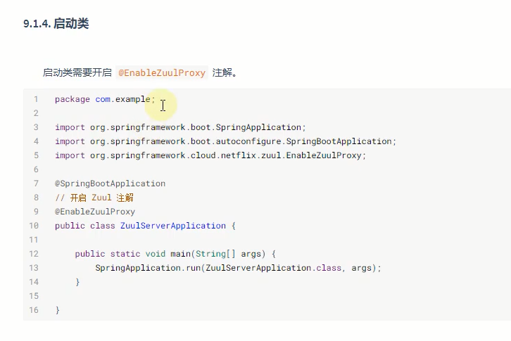
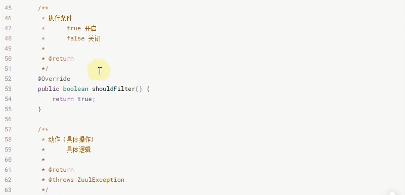

#Zuul服务网关
##学习目标

##什么是zuul

##什么是服务网关

##为什么要使用网关

##网关解决了什么问题

##常用网关解决方案

##环境搭建

##Nginx实现Api网关

##zuul实现api网关
###搭建服务网关

###配置路由规则

###路由排除

###路由前缀

**访问路径必须加上前缀**

##网关过滤器

###关键名词

###过滤器类型

###入门案例

###统一鉴权

##zuul请求的生命周期

##网关过滤器异常统一处理

###创建过滤器

###模拟异常

###配置文件

###访问

##zuul和hystrix无缝结合

###网关监控

###网关熔断

###网关限流

添加依赖

全局限流配置

局部限流配置

###网关调优

##zuul和Sentinel整合

##高可用网关