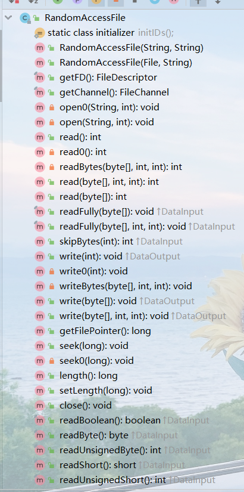
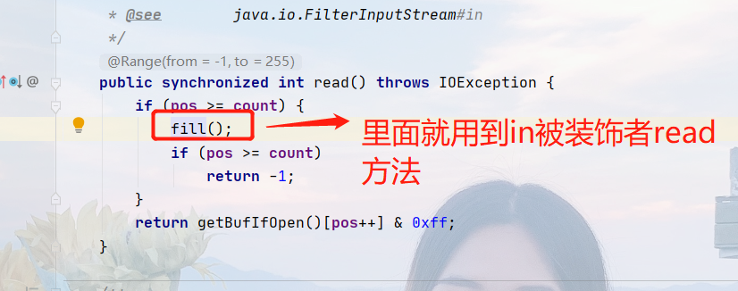

#第一章 基础

##File

- 万物皆对象，File表示文件、目录，要操作还得靠IO

##IO体系

###分类
- 方向：输入流、输出流
- 数据单位：字节流、字符流
- 角色：节点流、处理流

###抽象基类
- InputStream、OutputStream、Reader、Writer

- read时会阻塞，直到有数据可读了或者文件结束了（读完了）或者抛异常了，在文件操作上正常不会阻塞，因为如果没有数据了那也就是读完了。但是在socket中，你不知道客户端那边什么时候数据发送完成，所以没数据读时会阻塞。

- available()是还有多少字节可用，具体得看子类有没有实现，网络中因为可能分多次发送，所以不准，这个不会阻塞

- 不存在阻塞问题

- read时会阻塞，直到有数据可读了或者文件结束了（读完了）或者抛异常了，在文件操作上正常不会阻塞，因为如果没有数据了那也就是读完了。但是在socket中，你不知道客户端那边什么时候数据发送完成，所以没数据读时会阻塞。
- skip(long n)，也会阻塞，直到有字符可读或者抛异常或者文件结束，个人理解文件中不会阻塞，网络中才会

- 不存在阻塞问题

###访问文件（读写字节流、字符流）
- FileInputStream extends InputStream
- FileOutputStream extends OutputStream
- FileReader extends InputStreamReader
- FileWriter extends OutputStreamWriter

###访问数组
- ByteArrayInputStream extends InputStream
- ByteArrayOutputStream extends OutputStream
- CharArrayReader extends Reader
- CharArrayWriter extends Writer

- 跟访问文件的区别在于，一个源和目标是文件，一个是内存中数组
- 读写都是线程安全的
- 写入数组，数组自动扩容

###访问管道
- PipedInputStream
- PipedOutputStream
- PipedReader
- PipedWriter
- 来完成线程之间的通,互相配套使用

###访问字符串
- StringReader 
- StringWriter
- 类似于CharArrayReader、CharArrayWriter，一个数据目标和源是char[]，一个是String

###缓冲流
- BufferedInputStream extends FilterInputStream
- BufferedOutputStream extends FilterOutputStream
- BufferedReader extends Reader
- BufferedWriter extends Writer

- 内部提供缓冲数组 byte[]，默认8k
- 读数据时，会一次性从文件读满到缓冲区，再从缓冲区读
- 写数据时，会先写到缓冲区，满了再写到文件
- flush强制缓冲区写入文件
- 效率高

###转换流
- InputStreamReader extends Reader
  - 将字节输入流按字符集转换成字符输入流
- OutputStreamWriter extends Writer
  - 将字符输出流按字节转换成字节输出流

- 一般用来处理编码解码问题
- 字节流中的数据都是字符的话转化为字符流会比较高效
- 编码：字符串到字节数组，将字符串按指定编码转为字节数组存储
- 解码：字节数组到字符串，将字节数组按指定编码转为字符串
- 构造器中指定编码集

###过滤流
- FilterInputStream extends InputStream
- FilterOutputStream extends OutputStream
- FilterReader extends Reader
- FilterWriter extends Writer
- 作为装饰者，用来过渡？意义何在？

###数据流
- DataInputStream
- DataOutputStream
- 将基本类型和String类型写入文件和从文件读取
- 写入和读取顺序要一致

###对象流
- ObjectInputStream：二进制流转为对象
- ObjectOutputStream：对象转为二进制流
- 可以用来对象序列化和反序列化
- serialVersionUID保证一致，序列化和反序列化是同一个，如果不显示指定，则会自动生成，类信息一变这个值就变了，就反序列化不回来了
- 实现Serializable这个接口
- 不能序列化static和transient修饰的成员变量

###打印流
- PrintStream
- PrintWriter

###标准输入输出流
- System.in
- System.out
- System.err

###推回输入流
- PushbackInputStream
- PushbackReader
- 将从流读取的数据再推回到流中
###随机存取文件流

- 可以理解跟上面是另外一体系

- 既能读也能写

- 有指针，能随机读写

##IO操作三部曲
- 造文件
- 造流（节点流）
- 造流（处理流）
- 读写操作
- finally关流

#第二章 用到的设计模式

##装饰者模式
- InputStream:抽象基类
- FileInputStream:主体类（节点流）
- FilterInputStream:装饰抽象类
- BufferedInputStream:装饰具体类（处理流） 

##适配器模式（对象适配器）
- Reader：适配类抽象
- InputStreamReader：具体适配类
- InputStream：被适配类

- OutputStreamWriter类似

#第三章 System类说明

#第四章 Runtime类说明